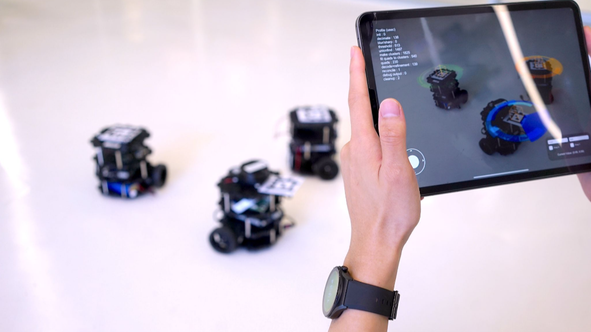

# super-controller
Super Controller introduces "What You See is What You Control" for managing multi-robots. Unlike traditional joystick pairing, users scan tags on robots using cameras and select them to control corresponding robots. This approach aims to improve usability for workers managing multi-robots simultaneously.



## **Requirements**
Python 3.8 minimum
 * A [zenoh router](http://zenoh.io/docs/getting-started/quick-test/)
 * The [zenoh/DDS bridge](https://github.com/eclipse-zenoh/zenoh-plugin-dds#trying-it-out)
 * [zenoh-python](https://github.com/eclipse-zenoh/zenoh-python): install it with `pip install eclipse-zenoh`.
 * [pycdr2](https://pypi.org/project/pycdr2/): install it with `pip install pycdr2`.

### Super Controller
- An app made by Unity that can choose what robot you want to control.
### Unity Server
- Receive the unity data and light data. And send the velocity command to the Zenoh Robot Manager.
### Zenoh Robot Manager
- Receive the velocity command and send the command to the robots through Zenoh respectively.
---
## **Test**
### Raspberry PI (Unity Server)

```
python3 UnityServer.py
```
### PC (Robot Manager)
Start the zenoh router on PC then run the manager.
```
zenohd
```
```
python3 robot_manager.py
```
### Multi-Robot
#### Evpi
Run Evpi first. Then start zenoh/DDS bridge
```
zenoh-bridge-dds -s evpi0 -e tcp/$(Robot Manager IP):7447
```
#### Pangolin Robot
Run pangolin robot first. Then start zenoh/DDS bridge
```
ros2 launch pangolin_bringup pangolin_bringup.py
```
```
zenoh-bridge-dds -s pangolin0 -e tcp/$(Robot Manager IP):7447
```
#### Turtlebot3
Run turtlebot3 first. Then start zenoh/DDS bridge
```
ros2 launch turtlebot3_bringup robot.launch.py
```
```
zenoh-bridge-dds -e tcp/$(Robot Manager IP):7447
```

## **Demo**
<a href="https://youtu.be/iEp8NJe1Z8A?si=cfXtF-F2NAqpjik3" title="Link Title"></a>